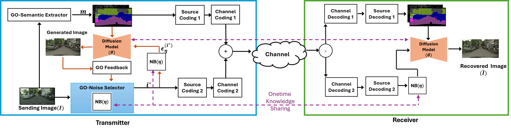

# $Diff-GO: Enhancing Diffusion Models for Goal-Oriented Communications

### [Suchinthaka Wanninayaka](#), [Achintha Wijesinghe](#), [Weiwei Wang](#), [Yu-Chieh Chao](#), [Songyang Zhang](#), and [Zhi Ding](#)  

[[ArXiv Preprint](https://arxiv.org/abs/2412.06980)]  

This repository is under construction! 🚧  

📢 **Update**: Stay tuned for the release of pretrained models and implementation details!  

---

### 📄 Abstract  
The rapid expansion of edge devices and Internet-of-Things (IoT) continues to heighten the demand for data transport under limited spectrum resources. The goal-oriented communications (GO-COM), unlike traditional communication systems designed for bit-level accuracy, prioritizes more critical information for specific application goals at the receiver. To improve the efficiency of generative learning models for GO-COM, this work introduces a novel noise-restricted diffusion-based GO-COM (Diff-GOn) framework for reducing bandwidth overhead while preserving the media quality at the receiver. Specifically, we propose an innovative Noise-Restricted Forward Diffusion (NR-FD) framework to accelerate model training and reduce the computation burden for diffusion-based GO-COMs by leveraging a pre-sampled pseudo-random noise bank (NB). Moreover, we design an early stopping criterion for improving computational efficiency and convergence speed, allowing high-quality generation in fewer training steps. Our experimental results demonstrate superior perceptual quality of data transmission at a reduced bandwidth usage and lower computation, making Diff-GOn well-suited for real-time communications and downstream applications.

### 🎯 The Diff-GOn Framework  
  

[//]: # (Our framework consists of two phases:  )

[//]: # (1️⃣ **Training Phase** - Leverages NR-FD and noise banks to efficiently train a diffusion model for GO-COM.  )

[//]: # (2️⃣ **Communication Phase** - Uses a structured noise selection and transmission strategy to optimize real-time performance.  )

[//]: # ()
[//]: # (---)

[//]: # ()
[//]: # (### 📊 Main Results  )

[//]: # (#### 🔹 Diff-GOn vs. Existing Approaches  )

[//]: # (![Results]&#40;results.png&#41;  )

[//]: # (Our approach significantly reduces bandwidth requirements while achieving superior image reconstruction quality.  )

[//]: # ()
[//]: # (#### 🔹 Convergence Efficiency  )

[//]: # (![Convergence]&#40;convergence.png&#41;  )

[//]: # (Diff-GOn achieves faster training convergence compared to conventional diffusion-based GO-COM models.  )

[//]: # ()
[//]: # (---)

[//]: # ()
[//]: # (### ⚙️ How to Use Diff-GOn  )

[//]: # (#### 🏋️ Train Diff-GOn  )

[//]: # (1. Install dependencies:  )

[//]: # (   ```bash)

[//]: # (   pip install -r requirements.txt  )

[//]: # (   conda install pytorch torchvision -c pytorch  )
